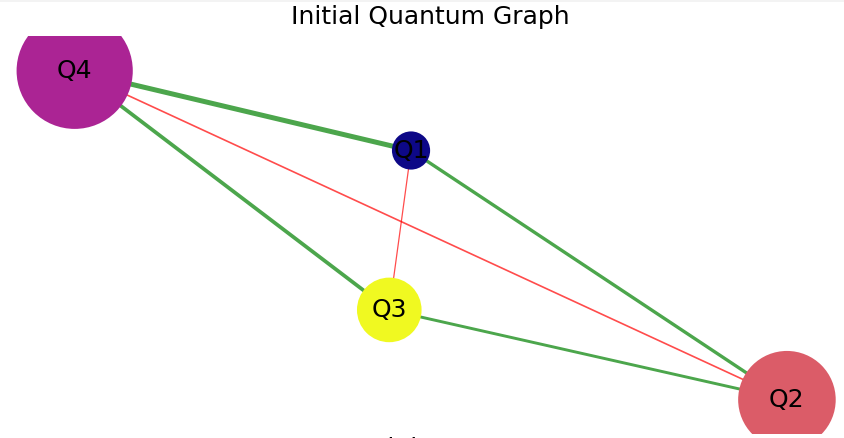
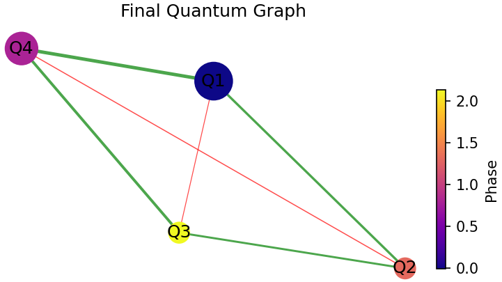
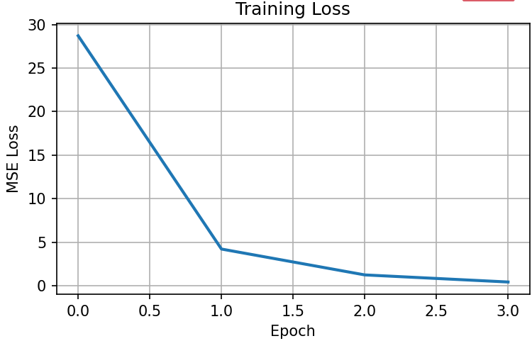
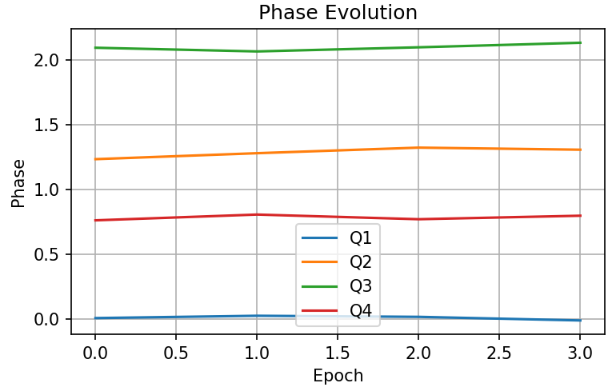

# Quantum-Inspired Graph Learning Framework

> **Research Prototype | Quantum-Inspired Machine Learning | Graph Neural Networks | Dynamical Systems**

An experimental framework investigating whether quantum-inspired phase dynamics can enhance graph-based learning systems through phase-aware message passing, adaptive graph learning, and dynamic state evolution.

---

> ⚠️ **Current Status**
>
> This repository is currently at **Milestone 1 (Research Prototype)**.
>
> The current implementation focuses on graph construction, quantum-inspired dynamics, learning mechanisms, and visualisation.
>
> Formal Graph Neural Network layers, benchmark datasets, and large-scale evaluation frameworks are planned for future milestones.

---

## Contents

* [Overview](#overview)
* [Motivation](#motivation)
* [Why This Project?](#why-this-project)
* [Current Features](#current-features)
* [Architecture](#architecture)
* [Visualisation Dashboard](#visualisation-dashboard)
* [Research Questions](#research-questions)
* [Progress & Milestones](#progress--milestones)
* [Roadmap](#roadmap)
* [Installation](#installation)
* [Repository Structure](#repository-structure)
* [Future Research Directions](#future-research-directions)
* [Author](#author)
* [License](#license)

---

# Overview

The **Quantum-Inspired Graph Learning Framework** is an exploratory machine learning project investigating the intersection of:

* Quantum Computing
* Graph Neural Networks (GNNs)
* Dynamical Systems
* Artificial Intelligence

The framework models a graph of interconnected computational nodes where each node maintains internal quantum-inspired state variables:

* Energy
* Phase
* Trainable Weights
* Trainable Biases

Information propagates through the graph using weighted neighbour interactions, while phase-dependent interference dynamically modulates communication between nodes.

The long-term goal is to evolve this prototype into a full **Quantum-Inspired Graph Neural Network (QGNN)** capable of learning from real-world graph datasets and benchmarking against traditional GNN architectures.

---

# Motivation

As a Computer Science student with interests in both Artificial Intelligence and Quantum Computing, I wanted to challenge myself by building a project that combines concepts from both fields.

This project serves as both:

* A learning platform for understanding graph-based machine learning and quantum-inspired computation.
* A long-term research project exploring novel approaches to graph learning.

The framework is intended to continuously evolve as new concepts, techniques, and experimental results are incorporated.

---

# Why This Project?

Traditional Graph Neural Networks primarily rely on neighbourhood aggregation and learned feature transformations.

This project explores whether introducing quantum-inspired concepts such as:

* Phase
* Interference
* Dynamic state evolution
* Stochastic perturbation

can influence learning behaviour and potentially provide richer graph representations.

Rather than attempting to simulate a true quantum computer, this framework investigates whether useful learning mechanisms can emerge from **quantum-inspired dynamics implemented on classical hardware**.

---

# Current Features

## Graph-Based Architecture

* Custom graph implementation
* Custom node implementation
* Weighted graph connections
* Bidirectional neighbour communication

## Quantum-Inspired Node Dynamics

Each node maintains:

* Energy State
* Phase State
* Trainable Bias
* Trainable Edge Weights

## Phase-Dependent Interference

Neighbour interactions are influenced by:

```text
Interference = cos(phase_difference)
```

allowing message propagation strength to vary according to phase relationships between connected nodes.

## Learning System

Current implementation includes:

* Forward propagation
* Local error-driven learning updates
* Mean Squared Error (MSE) loss
* Adaptive weight updates
* Adaptive bias updates

## Dynamic Phase Evolution

The framework currently incorporates stochastic phase drift to simulate evolving quantum-inspired behaviour.

## Visualisation Dashboard

Automatically generates:

* Initial Graph State
* Final Graph State
* Training Loss Curve
* Phase Evolution Plot

---

# Architecture

Current propagation pipeline:

```text
Input Graph
     │
     ▼
Neighbour Aggregation
     │
     ▼
Phase Interference Modulation
     │
     ▼
Weighted Message Passing
     │
     ▼
ReLU Activation
     │
     ▼
Energy Update
     │
     ▼
Loss Calculation
     │
     ▼
Weight & Bias Update
```

---

# Visualisation Dashboard

The current prototype generates four visual outputs to aid interpretation and debugging.

## Initial Graph

Visual representation of node energies, phases, and weighted connections before training.





## Final Graph

Visual representation of graph state after learning updates.



## Training Loss

Tracks Mean Squared Error throughout training.



## Phase Evolution

Tracks phase changes across all nodes over time.



---

# Research Questions

This project currently investigates the following questions:

### 1. Can phase-dependent interference improve graph message passing?

### 2. Can quantum-inspired state variables create richer node representations?

### 3. How do dynamic phase interactions affect learning stability?

### 4. Can quantum-inspired propagation mechanisms compete with traditional GNN architectures?

### 5. How should quantum-inspired concepts be integrated into graph learning systems?

---

# Progress & Milestones

## Milestone 1 — Research Prototype

**Status:** ✅ Complete

Implemented:

* [x] Custom graph structure
* [x] Custom node representation
* [x] Energy modelling
* [x] Phase modelling
* [x] Weighted message passing
* [x] Phase interference mechanism
* [x] Forward propagation
* [x] Local learning updates
* [x] Loss tracking
* [x] Dynamic phase evolution
* [x] Visualisation dashboard
* [x] Academic prototype submission

This milestone establishes the first complete working prototype.

---

## Milestone 2 — Formal Graph Neural Network Layer

**Status:** 🔄 Planned

Objectives:

* [ ] Formal message passing layer
* [ ] Node feature vectors
* [ ] Improved learning architecture
* [ ] Modular propagation framework
* [ ] Scalable graph support

---

## Milestone 3 — Real Dataset Integration

**Status:** 📋 Planned

Potential datasets:

* Cora
* CiteSeer
* PubMed
* MUTAG

Objectives:

* [ ] Node classification
* [ ] Graph classification
* [ ] Dataset preprocessing
* [ ] Performance evaluation

---

## Milestone 4 — Advanced Quantum-Inspired Dynamics

**Status:** 📋 Planned

Objectives:

* [ ] Complex-valued representations
* [ ] Quantum-walk-inspired propagation
* [ ] Enhanced phase modelling
* [ ] Decoherence-inspired mechanisms
* [ ] Alternative interference functions

---

## Milestone 5 — Benchmarking & Evaluation

**Status:** 📋 Planned

Objectives:

* [ ] Compare against standard GNNs
* [ ] Compare convergence behaviour
* [ ] Stability analysis
* [ ] Learning performance evaluation

---

## Milestone 6 — Research-Grade Framework

**Status:** 🎯 Long-Term Goal

Objectives:

* [ ] Full Quantum-Inspired GNN architecture
* [ ] Modular framework design
* [ ] Reproducible experiments
* [ ] Research publication preparation
* [ ] Open-source research platform

---

# Roadmap

```text
Milestone 1  ██████████ Complete

Milestone 2  ███░░░░░░░ In Progress

Milestone 3  ░░░░░░░░░░ Planned

Milestone 4  ░░░░░░░░░░ Planned

Milestone 5  ░░░░░░░░░░ Planned

Milestone 6  ░░░░░░░░░░ Planned
```

---

# Installation

## Requirements

* Python 3.12.10

## Install Dependencies

```bash
pip install matplotlib networkx
```

## Run Project

```bash
python main.py
```

---

# Repository Structure

```text
quantum-inspired-graph-learning/
│
├── Node.py
├── Graph.py
├── main.py
├── graph_representation.py
├── README.md
│
└── docs/
    ├── initial_graph.png
    ├── final_graph.png
    ├── loss_curve.png
    └── phase_evolution.png
```

---

# Future Research Directions

Potential areas of investigation include:

* Quantum-inspired message passing
* Graph representation learning
* Dynamical graph systems
* Complex-valued neural networks
* Quantum machine learning
* Explainable graph learning
* Physics-inspired artificial intelligence

---

# Author

**Muhammad Azaan Anjam**

Computer Science Student

Newcastle University

GitHub: https://github.com/Azaan78

Copyright (c) 2026 Muhammad Azaan Anjam
